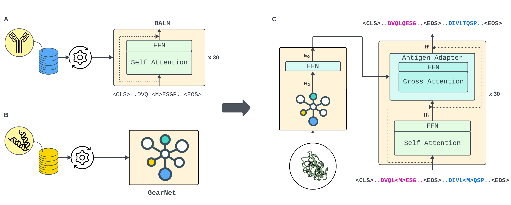

<div align="center">

# Aligned Integrated Design for Antibodies (AIDA)
<a href="https://github.com/ashleve/lightning-hydra-template"></a>
[](https://github.com/pre-commit/pre-commit)
[](https://pytorch.org/get-started/locally/)
[](https://pytorchlightning.ai/)
[](https://hydra.cc/)
[](https://black.readthedocs.io/en/stable/)

**Conditional Sequence-Structure Integration: A Novel Approach for Precision Antibody Engineering and Affinity Optimization**
</div>




This repository presents a novel approach to designing antibodies by integrating structural and sequence information of antigens. Our method employs a protein structural encoder to capture both sequence and conformational details of the antigen, which are then used by an antibody language model (aLM) with cross-attention layers to generate antibody sequences. Unlike other methods, our model does not require additional contextual information, such as epitope residues or a docked antibody framework. The model is trained using the Causal Masked Language Modeling (CMLM) objective and demonstrates superior performance in the RAbD benchmark for antibody design and SKEPMI for antibody optimization.

## Features
- Protein structural encoder to capture antigen details.
- Antibody language model (aLM) with cross-attention layers.
- Causal Masked Language Modeling (CMLM) for model training.
- No need for supplementary data like epitope residues or docked antibody frameworks.
- Superior performance in antibody design and optimization benchmarks.

## Usage
### Installation
```bash
# clone project
git clone --recursive https://github.com/benyaminjami/AIDA.git
cd AIDA

# create conda virtual environment
conda env create -f environment.yml
conda activate AIDA
```

Install [ torch ](https://pytorch.org/get-started/locally/) based on your setting.

### Setup
Follow [instruction ](SAbDab/README.md) to download and prepare SAbDab dataset for training and testing.

### Pre-trained models
Downloading the paired BALM (In order to train paired BALM, please refer to Paired-BALM [repo](https://github.com/benyaminjami/Paired-BALM)).
```bash
wget https://github.com/benyaminjami/Paired-BALM/releases/download/weights/pretrained_PBALM.tar.gz -P data/pretrained_models/
tar -xf data/pretrained_models/pretrained_PBALM.tar.gz -C data/pretrained_models/
```
Downloading the pre-trained GearNet (link from GearNet [repo](https://github.com/DeepGraphLearning/GearNet?tab=readme-ov-file)).
```bash
mkdir data/pretrained_models/pretrained-gearnet
wget https://zenodo.org/records/7593637/files/mc_gearnet_edge.pth?download=1 -O data/pretrained_models/pretrained-gearnet/mc_gearnet_edge.pth
```

## Citation
[Details on how to cite this work if used in research]

## License
[License information]
